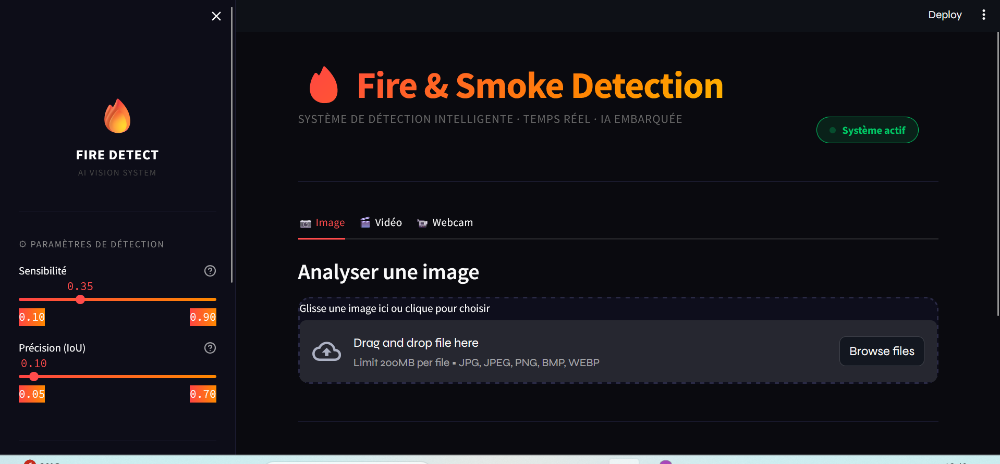
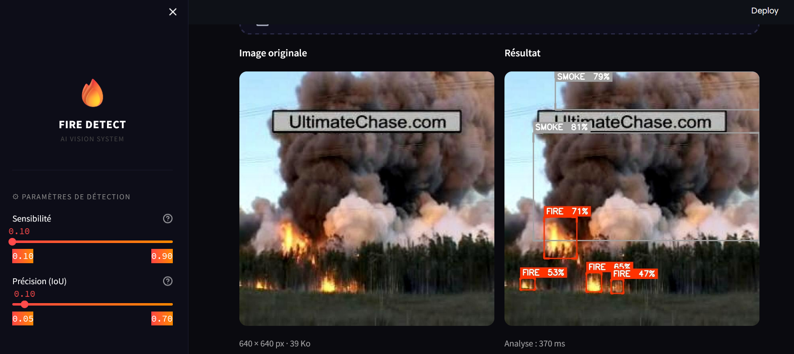
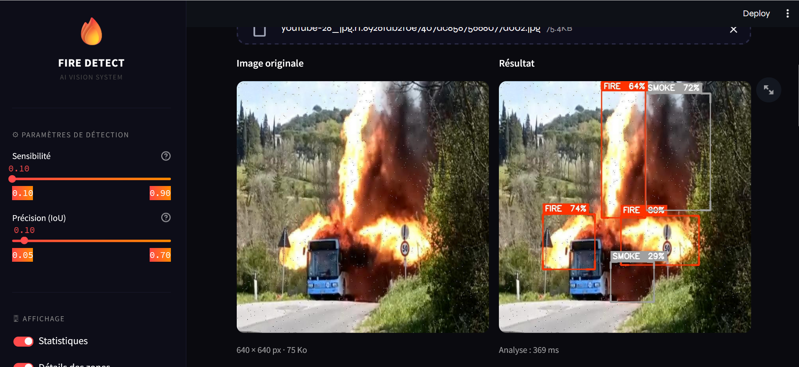
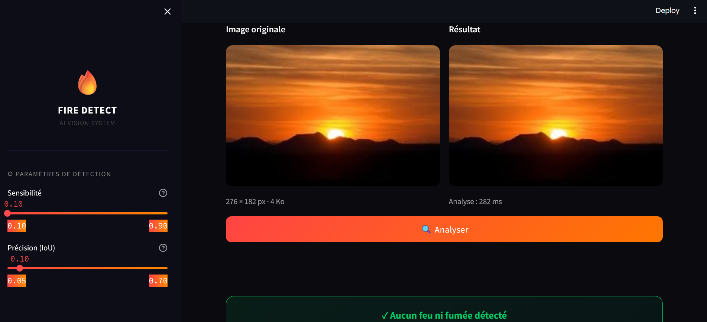
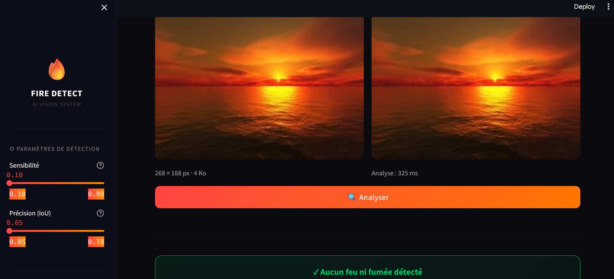
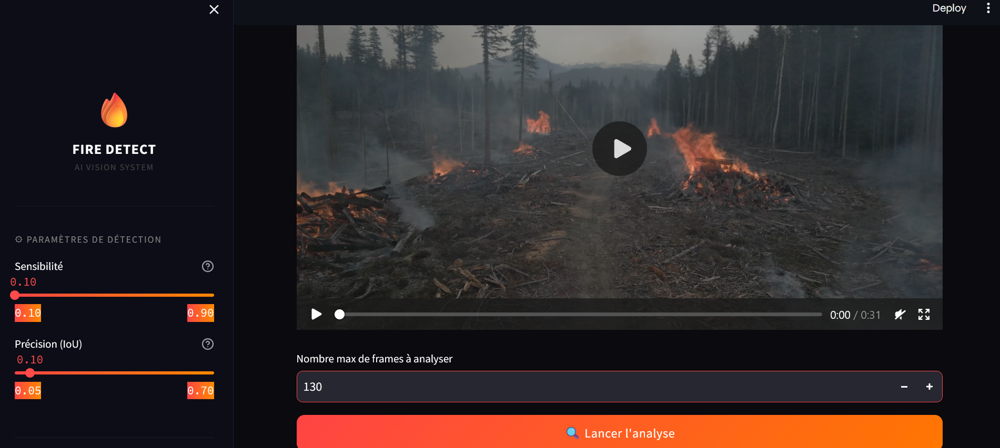
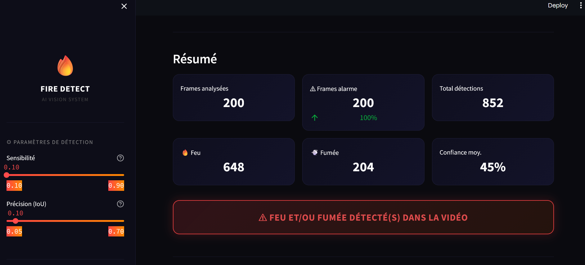
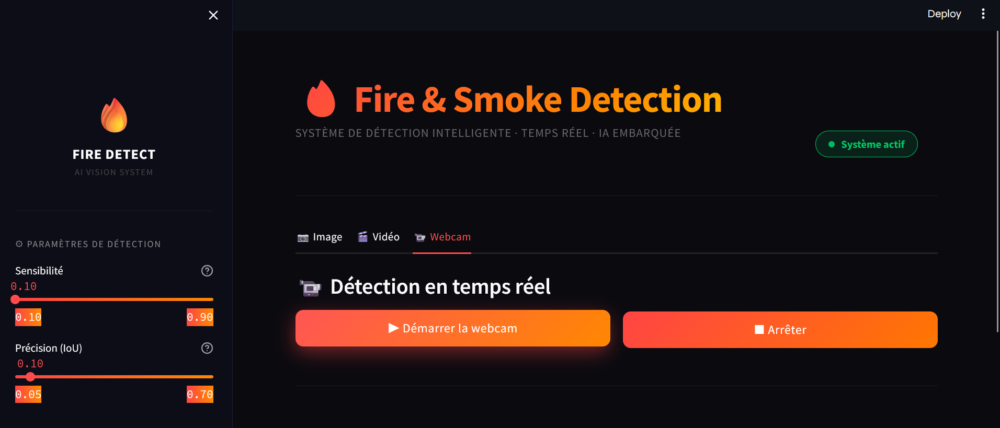

# 🔥 Fire & Smoke Detection — AI Vision System

<p align="center">
  
  
  
  
</p>

<p align="center">
  Système intelligent de détection de feux et de fumée en temps réel,<br>
  avec recommandations de reboisement.
</p>

---

## ✨ Fonctionnalités

| Fonctionnalité | Description |
|---|---|
| 📷 **Analyse d'image** | Détection feu/fumée sur une image uploadée |
| 🎬 **Analyse vidéo** | Traitement frame par frame avec résumé global |
| 📹 **Webcam temps réel** | Détection en direct depuis la caméra |
| 🧠 **Pipeline 2 étapes** | Classificateur → Détecteur (optimisé, sans faux positifs) |
| 🌳 **Reboisement** | Recommandations post-incendie selon le niveau de dégâts |
| 🎨 **UI dark premium** | Interface moderne, thème sombre, animations |

---

## 🧠 Architecture du Pipeline

```
Image / Frame
     │
     ▼
┌─────────────────┐
│  CLASSIFICATEUR │  ← YOLOv11 (best_cls.pt)
│  (Fire / No Fire)│
└─────────────────┘
     │
     ├─── ❌ Pas de feu → Ignoré (rapide)
     │
     └─── ✅ Feu détecté
                │
                ▼
        ┌──────────────┐
        │  DÉTECTEUR   │  ← YOLOv11 (best_dtc.pt)
        │  (Bounding   │
        │   Boxes)     │
        └──────────────┘
                │
                ▼
        Résultat annoté +
        Recommandations reboisement
```

---

## 🌳 Recommandations de Reboisement

Après chaque détection, le système calcule le **niveau de dégâts** (% de surface affectée) et propose des recommandations :

| Niveau | Dégâts | Recommandation |
|---|---|---|
| 🌱 **Faible** | < 30 % | Régénération naturelle, surveillance 1-2 saisons |
| 🌿 **Modéré** | 30–70 % | Reboisement assisté + espèces adaptées au climat |
| 🚨 **Sévère** | > 70 % | Intervention d'experts — plan en 5 étapes |

---

## 🚀 Installation

### Prérequis

- Python 3.8+
- pip

### Étapes

```bash
# 1. Cloner le dépôt
git clone https://github.com/MAIRImanar/fire-smoke-detection.git
cd fire-smoke-detection

# 2. Installer les dépendances
pip install streamlit ultralytics opencv-python pillow numpy

# 3. Placer les modèles dans le dossier models/
mkdir -p models
# → models/best_dtc.pt  (modèle de détection)
# → models/best_cls.pt     (modèle de classification)

# 4. Lancer l'application
streamlit run App.py
```

---

## 📁 Structure du projet

```
fire-smoke-detection/
│
├── App.py                  # Application principale Streamlit
├── README.md
│
└── models/
    ├── best_cls.pt    # YOLOv11 — Détection (bounding boxes)
    └── best_dtc.pt       # YOLOv11 — Classification (fire / no fire)
```

---

## ⚙️ Paramètres

Les paramètres sont accessibles depuis la **barre latérale** de l'application :

| Paramètre | Valeur par défaut | Description |
|---|---|---|
| Sensibilité | 0.35 | Seuil de confiance minimum pour valider une détection |
| Précision (IoU) | 0.10 | Suppression des boîtes redondantes |
| Statistiques | Activé | Affiche les métriques de détection |
| Détails des zones | Activé | Affiche les détails de chaque zone détectée |

---

## 🖼️ Aperçu

### Interface principale
<p align="center">
  
</p>

### 🔥 Détection de feu et fumée
> Détection avec bounding boxes, niveau de confiance par zone (FIRE 80 % · SMOKE 62 %).
<p align="center">
  
  
</p>

### ✅ Aucune menace détectée
> Le pipeline ignore les images sans feu (ex. coucher de soleil) — aucun faux positif.
<p align="center">
  
  
</p>

### 🎬 Analyse vidéo
<p align="center">
  
  
</p>

### 📹 Webcam temps réel
<p align="center">
  
</p>

---

## 🌳 Recommandations de Reboisement
<p align="center">
  
</p>

---

## 🛠️ Technologies utilisées

- **[Streamlit](https://streamlit.io/)** — Framework web Python
- **[Ultralytics YOLO](https://github.com/ultralytics/ultralytics)** — Modèles YOLOv11
- **[OpenCV](https://opencv.org/)** — Traitement d'image et vidéo
- **[NumPy](https://numpy.org/)** — Calcul du niveau de dégâts (masque pixel)
- **[Pillow](https://pillow.readthedocs.io/)** — Export des images annotées

---

## 📄 Licence

Ce projet est à usage privé / commercial. Tous droits réservés.

---

<p align="center">
  Fire &amp; Smoke Detection &nbsp;·&nbsp; AI Vision System &nbsp;·&nbsp; v2.0
</p>
